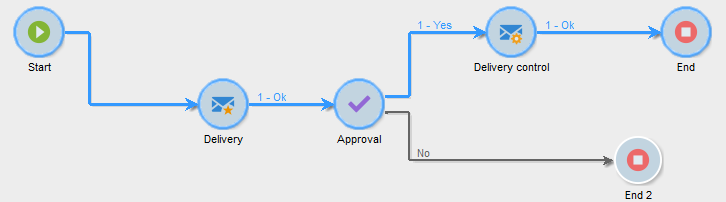
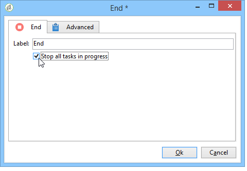
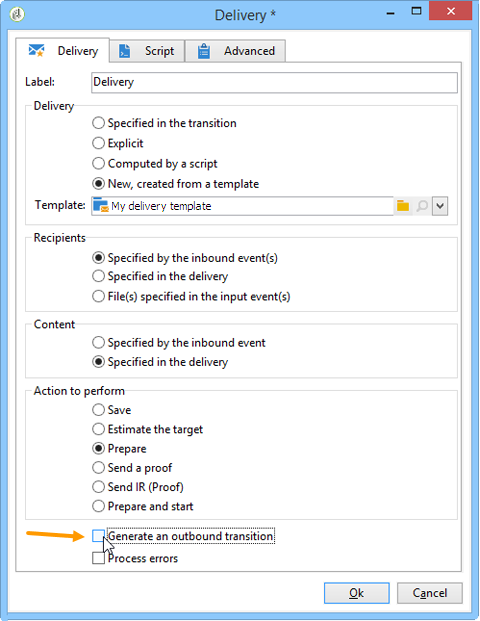

# Start and end{#start-and-end}

The **[!UICONTROL Start]** and **[!UICONTROL End]** activities allow you to graphically mark the start and end of a workflow. These activities have no functional impact and are therefore optional.

* **[!UICONTROL Start]**

  Executing a workflow starts with activities without an inbound transition and Start-type activities.

  

* **[!UICONTROL End]**

  You can configure the **[!UICONTROL End]** activity to interrupt all tasks that are in progress. To do this, double-click the activity to display its properties, and check the appropriate option.

  

  The data in the worktable is deleted automatically when the end activity is enabled. If this isn't necessary, and to avoid unnecessary loads, you can choose to disable the transition at the last activity output. For example, at a delivery output, if no process is scheduled, uncheck the relevant option as shown below:

  

