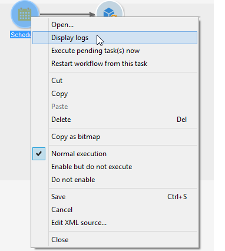

# Starting a workflow {#starting-a-workflow}

A workflow is always started manually. When started, it can however remain inactive depending on the information specified via a scheduler (see [Scheduler](scheduler.md)) or activity scheduling.

Actions related to targeting workflow execution (launch, stop, pause, etc.) are **asynchronous** processes: the order is recorded and will be effective as soon as the server is available to apply it.

The toolbar allows you to start and track the execution of the workflow.

The list of options available in the **[!UICONTROL Actions]** menu and the right-click menu are detailed below.

>[!IMPORTANT]
>
>Keep in mind that, when an operator performs an action on a workflow (start, stop, pause, etc.), the action is not executed straightaway, but instead placed in a queue in order to be processed by the [workflow module](architecture.md).

## Actions toolbar {#actions-toolbar}

The toolbar buttons are detailed in this [section](../../campaign/using/marketing-campaign-deliveries.md#building-the-main-target-in-a-workflow). The **[!UICONTROL Actions]** button gives you access to additional execution options for acting on selected workflows. You can also use the **[!UICONTROL File > Actions]** menu, or right-click a workflow and select **[!UICONTROL Actions]**.

* **[!UICONTROL Start]**

  This action lets you start the execution of a workflow: a workflow that is **Finished**, **Being edited** or **Paused** changes status to **Started**. The workflow engine then handles the execution of this workflow. If the workflow was paused, it is resumed, otherwise the workflow is started from the beginning and the initial activities are activated.

  Starting is an asynchronous process: The request is saved and is processed as soon as possible by a workflow server.

* **[!UICONTROL Pause]**

  This action sets the status of the workflow to **Paused**. No activities are activated until the workflow is resumed; however the operations in progress are not paused.

* **[!UICONTROL Stop]**

  This action stops a workflow currently being executed. The status of the instance is set to **Finished**. Operations in progress are stopped, if possible. Imports and SQL queries are canceled immediately.

  Stopping is an asynchronous process. The request is registered, then the workflow server or servers cancel operations in progress. Stopping a workflow instance can therefore take time, especially if the workflow is running on multiple servers, each one of which must take control to cancel the tasks in progress.

* **[!UICONTROL Restart]**

  This action stops then restarts the workflow. In most cases, it makes it possible to restart faster. It is also useful to automate restarting when stopping takes a certain amount of time: this is because the 'Stop' command is not available when the workflow is being stopped.

  The **[!UICONTROL Start / Pause / Stop / Restart]** actions are also available via the execution icons in the toolbar. For more on this, refer to this [section](../../campaign/using/marketing-campaign-deliveries.md#creating-a-targeting-workflow).

* **[!UICONTROL Purge history]**

  This action lets you purge the workflow history. For more on this, refer to [Purging the logs](monitoring-workflow-execution.md#purging-the-logs).

* **[!UICONTROL Start in simulation mode]**

  This option lets you start the workflow in simulation mode as opposed to real mode. This means that when you enable this mode, only activities that do not impact the database or the file system are executed (e.g. **[!UICONTROL Query]**, **[!UICONTROL Union]**, **[!UICONTROL Intersection]**, etc.). Activities that do have an impact (e.g. **[!UICONTROL Export]**, **[!UICONTROL Import]**, etc.) as well as those after them (in the same branch) are not executed.

* **[!UICONTROL Execute pending tasks now]**

  This action lets you start all pending tasks as soon as possible. To start a specific task, right-click its activity and select **[!UICONTROL Execute pending task(s) now]**.

* **[!UICONTROL Unconditional stop]**

  This option changes the workflow status to **[!UICONTROL Finished]**. This action should only be used as a last resort if the normal stop process fails after several minutes. Only use the unconditional stop if you are sure there are no actual workflow jobs in progress.

  >[!CAUTION]
  >
  >This option is reserved for expert users.

* **[!UICONTROL Save as template]**

  This action creates a new workflow template based on the selected workflow. You need to specify the folder where it will be saved (in the **[!UICONTROL Folder]** field).

  The **[!UICONTROL Mass update of selected lines]** and **[!UICONTROL Merge selected lines]** options are generic platform options available in all **[!UICONTROL Actions]** menus. For more on this, refer to this [section](../../platform/using/updating-data.md).

## Right-click menu {#right-click-menu}

When one or more workflow activities are selected, you can right-click to act on your selection. 

The following options are available in the right-click menu:

**[!UICONTROL Open]**: this option lets you access the activity properties.

**[!UICONTROL Display logs:]** this option lets you view the task execution log for the selected activity. Refer to [Displaying logs](monitoring-workflow-execution.md#displaying-logs).

**[!UICONTROL Execute pending task(s) now:]** this action lets you start pending tasks as soon as possible.

**[!UICONTROL Workflow restart from a task:]** this option lets you restart the workflow using the results previously stored for this activity.

**[!UICONTROL Cut/Copy/Paste/Delete:]** these options let you cut, copy, paste and delete activities.

**[!UICONTROL Copy as bitmap:]** this option lets you take a screenshot of all activities.

**[!UICONTROL Normal execution / Enable but do not execute / Do not enable:]** these options are also available in the **[!UICONTROL Advanced]** tab of the activity properties. They are detailed in [Execution](advanced-parameters.md#execution).

**[!UICONTROL Save / Cancel:]** lets you save or cancel the changes made to a workflow.

>[!NOTE]
>
>You can select a group of activities and apply one of these commands to them.

The right-click menu is also detailed in this [section](../../campaign/using/marketing-campaign-deliveries.md#executing-a-workflow).
