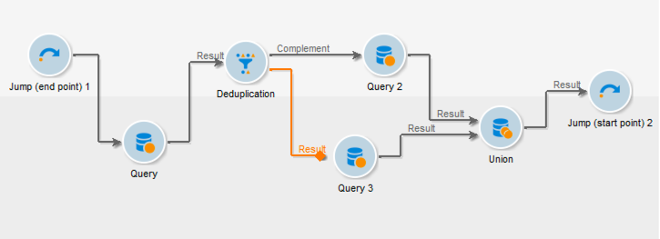
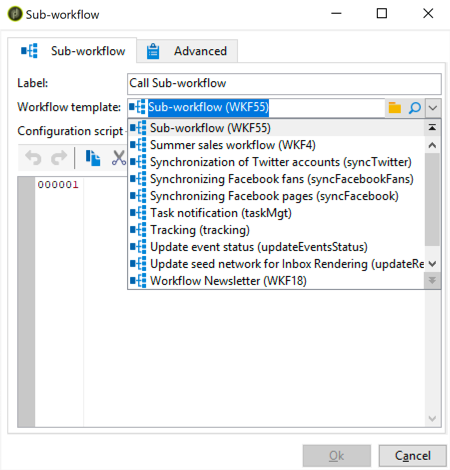
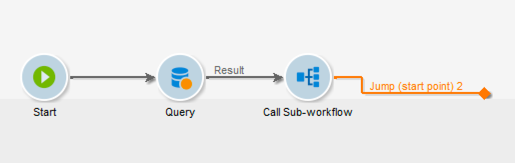
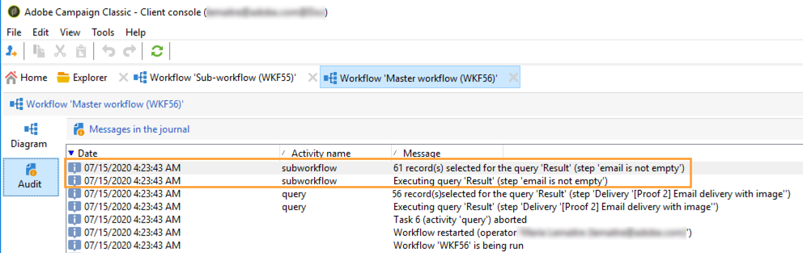

# Sub-workflow{#sub-workflow}

The **[!UICONTROL Sub-workflow]** activity lets you trigger the execution of another workflow and recover the result. This activity lets you use complex workflows while using a simplified interface.

You can call multiple sub-workflows in a single workflow. Sub-workflows are executed synchronously.

In the example below, a primary workflow is calling a sub-workflow using jumps. For more on jump-type graphical objects, see [this section](jump--start-point-and-end-point-.md).

1. Create a workflow that you will use as a sub-workflow in another workflow.
1. Insert a **[!UICONTROL Jump (end point)]** activity with a priority of 1 at the beginning of the workflow. If you have multiple "end point" type jumps, Adobe Campaign will use the "end point" jump with the lowest number.
1. Insert a **[!UICONTROL Jump (start point)]** activity with a priority of 2 at the end of the workflow. If you have multiple "start point" type jumps, Adobe Campaign will use the "start point" jump with the highest number.

   

   >[!NOTE]
   >
   >If the sub-workflow activity references a workflow with several **[!UICONTROL Jump]** activities, the sub-workflow is executed between the "end point" type jump with the lowest number and the "start point" type jump with the highest number.
   >
   >For the sub-workflow to be run correctly, you must have only one "end point" type jump with the lowest number, and only one "start point" type jump with the highest number.

1. Complete and save this "sub-workflow".
1. Create a primary workflow.
1. Insert a **[!UICONTROL Sub-workflow]** activity and open it.
1. Select the workflow that you want to use from the **[!UICONTROL Workflow template]** drop-down list.

   

1. You can also add a configuration script to alter the referenced workflow.
1. Click **[!UICONTROL Ok]**. It will automatically create an outbound transition with the label of the **[!UICONTROL Jump (start point)]** activity from the selected workflow.

   

1. Run the workflow.

Once run, the workflow that was called as a sub-workflow remains in **[!UICONTROL Being edited]** status, which means the following:

* You cannot right-click the transitions to display the target.
* The count of intermediate populations cannot be displayed.
* The sub-workflow logs display in the primary workflow.

   

>[!NOTE]
>
>If any error occurs in the sub-workflow, the primary workflow will pause and a copy of the sub-workflow will be created.

## Input parameters (optional) {#input-parameters--optional-}

* tableName
* schema

Each inbound event must specify a target defined by these parameters.

## Output parameters {#output-parameters}

* tableName
* schema
* recCount

This set of three values identifies the population targeted by the query. **[!UICONTROL tableName]** is the name of the table that records the target identifiers, **[!UICONTROL schema]** is the schema of the population (usually nms:recipient) and **[!UICONTROL recCount]** is the number of elements in the table.

* targetSchema: This value is the schema of the work table. This parameter is valid for all transitions with **[!UICONTROL tableName]** and **[!UICONTROL schema]**.
