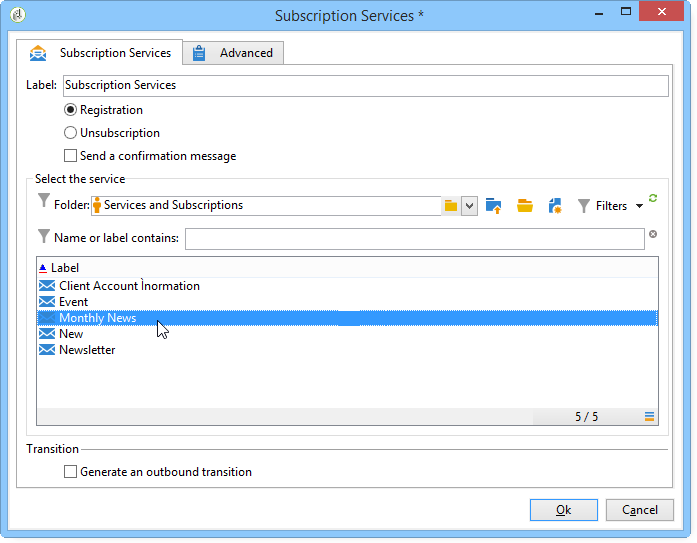
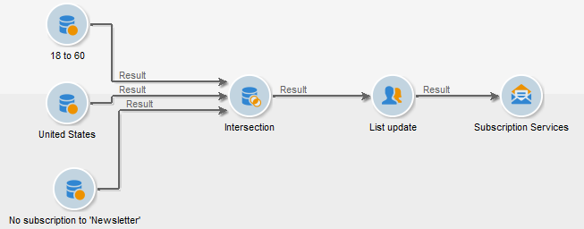

# Subscription Services{#subscription-services}

A **Subscription services**-type activity lets you create or delete a subscription to an information service for the population specified in the transition.

To configure it, edit the activity and enter its label, then select the action to be executed (Subscription or Unsubscription) and the service concerned, as in the following example:

1. Enter the activity's label.
1. Select **[!UICONTROL Generate an outbound transition]** if you wish to create a transition at the end of the execution.

   Generally, a target's subscription to an information service marks the end of the targeting workflow, which is why the option is not activated by default.

1. Click **[!UICONTROL Subscription]** or **[!UICONTROL Unsubscription]** if you wish to subscribe or unsubscribe the specified population to or from the selected information service.
1. Select **[!UICONTROL Send a confirmation message]** to notify recipients that they are subscribed to or unsubscribed from a service.

   The content of this message is specified in a delivery template related to the information service. For more on this, refer to this [section](../../delivery/using/managing-subscriptions.md).

## Example: Subscribe a list of recipients to a newsletter {#example--subscribe-a-list-of-recipients-to-a-newsletter}

In a single operation the following workflow aims to make a list of recipients eligible for a newsletter, aimed at working people living in Paris, in order to get them to subscribe.

To do this, you must also exclude recipients that have already subscribed.

>[!CAUTION]
>
>Before manually subscribing recipients to a service, verify that these recipients accept to receive communications from you.

1. Add the following three queries:

    * One targeting recipients aged 18 to 60 years old.
    * A second targeting recipients living in Paris.
    * A third targeting recipients that are not currently subscribed to the newsletter.

1. Add an intersection activity to cross reference the different results.
1. If you like, insert a list update to keep the list of latest subscribers up-to-date.
1. Insert a subscription services activity, then double click this to configure it.
1. Enter the activity label and select **[!UICONTROL Subscription]**.

   If you like, you can inform recipients of their newsletter subscription by checking the **[!UICONTROL Send a confirmation message]** box.

1. Select the folder the newsletter is in then select the newsletter from the list that appears.
1. Leave the **[!UICONTROL Generate outbound transition]** unchecked so that this activity will mark the end of the workflow, then click **[!UICONTROL Ok]**.

During workflow execution, the recipients that correspond to all three queries are added to the list and subscribed to the newsletter.

You can check that the subscription was successful by going to the **[!UICONTROL Subscription]** tab for your recipients.

## Input parameters {#input-parameters}

* tableName
* schema

Each inbound event must specify a target defined by these parameters.
