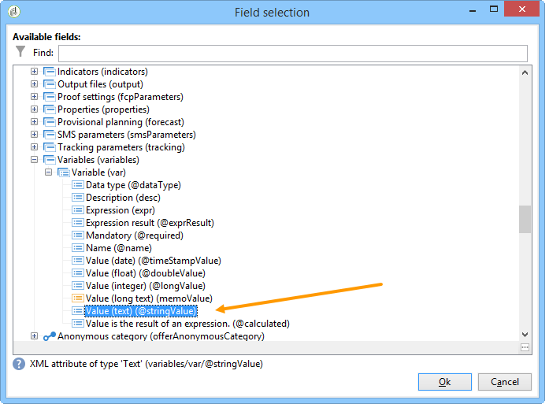

# Use case: supervise your workflows{#supervising-workflows}

This use case details the creation of a workflow that lets you monitor the status of a set of workflows that are "paused", "stopped" or "with errors".

Its purpose is to:

* Use a workflow to monitor a group of business workflows.
* Send a message to a supervisor via a "delivery" activity.

To monitor the status of a set of workflows, you need to follow these steps:

1. Create the monitoring workflow.
1. Write the JavaScript to determine whether workflows are paused, stopped, or with errors.
1. Create the **[!UICONTROL Test]** activity.
1. Prepare the delivery template.

>[!NOTE]
>
>In addition to the workflow, Campaign **Workflow Heatmap** allows you to analyse in details the workflows that are currently running. For more on this, refer to the [dedicated section](../../workflow/using/heatmap.md).
>
>For more on how to **monitor your workflows' execution**, refer to [this section](../../workflow/using/monitoring-workflow-execution.md).

## Step 1: Creating the monitoring workflow {#step-1--creating-the-monitoring-workflow}

The workflow folder that we are going to monitor is the **"CustomWorkflows"** folder stored in the **Administration > Production > Technical workflows** node. This folder contains a set of business workflows.

The **Monitoring workflow** is stored at the root of the Technical Workflows folder. The label used is **"Monitoring"**.

The following schema shows the sequence of activities:


This workflow is made up of:

* a **"Start"** activity.
* a **"JavaScript code"** activity responsible for analyzing the business workflows folder.
* a **"Test"** activity to send a delivery to the supervisor or re-start the workflow.
* a **"Delivery"** activity responsible for message layout.
* a **"Wait"** activity that controls the lead times between workflow iterations.

## Step 2: Writing the JavaScript {#step-2--writing-the-javascript}

The first part of the JavaScript code coincides with a **query (queryDef)** that lets you identify the workflows with a "pause" (@state == 13), "error" (@failed == 1) or "stopped" (@state == 20) status.

The **internal name** of the workflow folder to monitor is given in the following condition:

```
<condition boolOperator="AND" expr="[folder/@name] = 'Folder20'" internalId="1"/>
```

```
var strError = "";
var strPaused = "";
var strStop = "";

var queryWkfError = xtk.queryDef.create(
  <queryDef schema="xtk:workflow" operation="select">
    <select>
      <node expr="@internalName"/>
      <node expr="@state"/>
      <node expr="@label"/>
      <node expr="@failed"/>
      <node expr="@state"/>   
    </select>
    <where id="12837805386">
      <condition boolOperator="AND" expr="[folder/@name] = 'Folder20'" internalId="1"/>
        <condition boolOperator="AND" internalId="2">
          <condition boolOperator="OR" expr="@state = 20" internalId="3"/>
          <condition expr="@state = 13" internalId="4"/>
        </condition>  
    </where>
  </queryDef>
);
var ndWkfError = queryWkfError.ExecuteQuery(); 
```

The second part of the JavaScript code lets you **display a message for each workflow** based on the status recovered during the query.

>[!NOTE]
>
>The strings created must be loaded in the workflow's event variables.

```
for each ( var wkf in ndWkfError.workflow ) 
{
  if ( wkf.@state == 13 )  // Status 13 = paused
  {
    if ( wkf.@failed == 1 )
      strError += "<li>Workflow '" + wkf.@internalName + "' with the label '" + wkf.@label + "'</li>";
    else
      strPaused += "<li>Workflow '" + wkf.@internalName + "' with the label '" + wkf.@label + "'</li>";
  }
  
  if ( wkf.@state == 20 )  // Status 20 = stop
    strStop += "<li>Workflow '" + wkf.@internalName + "' with the label '" + wkf.@label + "'</li>";
}

vars.strWorkflowError = strError;
vars.strWorkflowPaused = strPaused;
vars.strWorkflowStop = strStop;
```

## Step 3: Creating the 'Test' activity {#step-3--creating-the--test--activity}

The "Test" activity lets you determine whether a delivery needs to be sent or whether the monitoring workflow needs to run another cycle based on the "Wait" activity.

A delivery is sent to the supervisor **if at least one of the three event variables "vars.strWorkflowError", "vars.strWorkflowPaused", or "vars.strWorkflowStop" is non-void.**


The "Wait" activity can be configured to re-start the monitoring workflow at regular intervals. For this use case, **the wait time is set to one hour**.


## Step 4: Preparing the delivery {#step-4--preparing-the-delivery}

The "Delivery" activity is based on a **delivery template** stored in the **Resources > Templates > Delivery templates** node.

This template must include:

* **the email address of the supervisor**.
* **HTML content** for inserting personalized text.

  

  The three variables declared (WF_Stop, WF_Paused, WF_Error) match the three workflow event variables.

  These variables must be declared in the **Variables** tab of the delivery template properties.

  To recover **the content of the workflow event variables**, you need to declare the variables specific to the delivery that will be initialized with values returned by the JavaScript code.

  The delivery template has the following content:

  

Once the template has been created and approved, you need to configure the **Delivery** activity to:

* link the "Delivery" activity to the delivery template created previously.
* link the workflow's event variables to those specific to the delivery template.

Double-click the **Delivery** activity and select the following options:

* Delivery: select **New, created from a template**, and select the delivery template created previously.
* For the **Recipients and Content** fields, select **Specified in the delivery**.
* Action to execute: select **Prepare and start**.
* Uncheck the **Process errors** option.

  

* Go to the **Script** tab of the **Delivery** activity, add three **character string** type variables via the personalization field menu. 

  

  

  The three variables declared are:

  ```
  delivery.variables._var[0].stringValue = vars.strWorkflowError;
  delivery.variables._var[1].stringValue = vars.strWorkflowPaused;
  delivery.variables._var[2].stringValue = vars.strWorkflowStop; 
  ```

Once this monitoring workflow is launched, it sends the following summary to the recipient:


