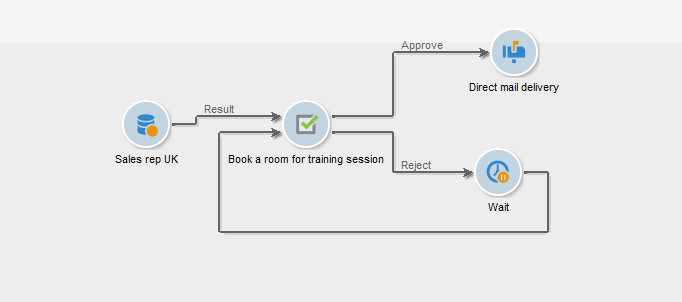
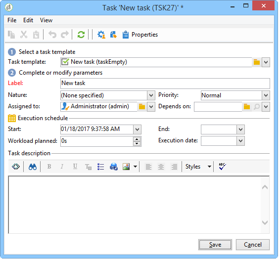

# Task{#task}

>[!AVAILABILITY]
>
>:warning: This capability is only available in Campaign Classic v7. [Learn more](../../mrm/using/creating-and-managing-tasks.md)

In a campaign workflow, the **[!UICONTROL Task]** activity lets you specify two scenarios: the first if the task is completed and a second if the task is not completed (if it is manually marked as incomplete or if it expires).

How to configure and operate a task is detailed in [Campaign Classic v7 documentation](../../mrm/using/creating-and-managing-tasks.md).

The **[!UICONTROL Resources]** option lets you define several operators as well as an approval schedule for the task. If the person approving rejects, this does not lead to the task itself being rejected.
