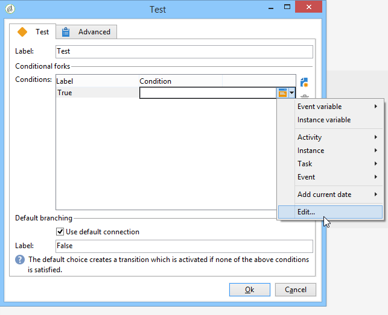

# Test{#test}

A **Test** type activity activates the first transition that satisfies the condition associated with it. If no condition is satisfied and if the **[!UICONTROL Use the default fork]** option is activated, the default transition will be activated.

A condition is a JavaScript expression that must be evaluated to 'true' or 'false'. To enter the expression, click the icon to the right of the name of the condition, and then select **[!UICONTROL Edit...]**.

For more information on all the additional JavaScript functions and SOAP methods of the applicative server accessible via workflow JavaScript, refer to [JSAPI documentation](https://docs.adobe.com/content/help/en/campaign-classic/technicalresources/api/index.html).

You can also insert variables directly from this editor. For more  information on how to work with variables, refer to [this section](javascript-scripts-and-templates.md#variables).

Conditions can be added, deleted, or ordered from the activity property edit window, but can also be modified from the transition.

If the result of a calculation is to be reused by different conditions, it is possible to calculate it in the initialization script of the activity. The result must be stored in a variable of the task to be accessed by the condition scripts (task.vars.xxx).
