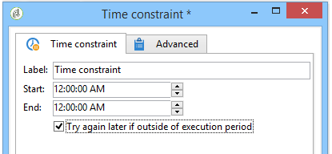

# Time constraint{#time-constraint}

A **Time constraint** activity lets you postpone the execution of a task or abandon it.

Enter the label for the activity and specify the time frame during which the workflow task must be paused.

When the **[!UICONTROL Try again later if outside of execution period]** option is selected, it lets you re-start the task outside of the execution time frame. if you want the workflow action to be abandoned for good after its suspension, deselect this option.

