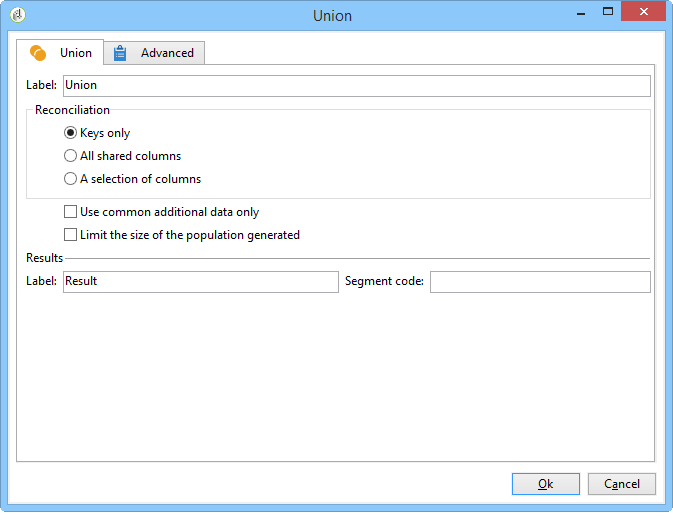
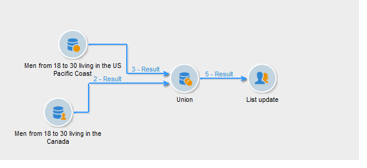

# Union{#union}

A union groups the result of several inbound activities in a single target. The target is created with all results received: all prior activities must therefore be finished for the union to be executed. 

>[!NOTE]
>
>For more on configuring and using the union activity, refer to [Combining several targets (Union)](../../workflow/using/union.md#combining-several-targets--union-).

## Union example {#union-example}

In the following example, the results from two queries have been combined in order to update the list. The two queries target the recipients. The results are therefore based on the same table.

1. Insert a **Union**-type activity straight after the two queries and before an update-type activity of the list then open it.
1. You may enter a label.
1. Select the **Keys only** reconciliation method since, in this example, the population resulting from queries contains consistent data.
1. If you have added additional data for the queries, you can decide to keep only the data that is shared.
1. If you wish to limit the size of the final population, check the **Limit size of generated population** box.

   Specify this final number by entering the maximum number of recipients and by selecting the query whose population will take priority.

1. Approve the union activity then configure the list update activity (see [List update](../../workflow/using/list-update.md)). 
1. Start the workflow. The number of results is displayed and the list defined in the list update activity is created or updated. This list contains the set of recipients for both queries or, where applicable, the number defined at the previous step.

   

## Input parameters {#input-parameters}

* tableName
* schema

Each inbound event must specify a target defined by these parameters.

## Output parameters {#output-parameters}

* tableName
* schema
* recCount

This set of three values identifies the target resulting from the union. **tableName** is the name of the table that records the target identifiers, **schema** is the schema of the population (usually nms:recipient) and **recCount** is the number of elements in the table.
