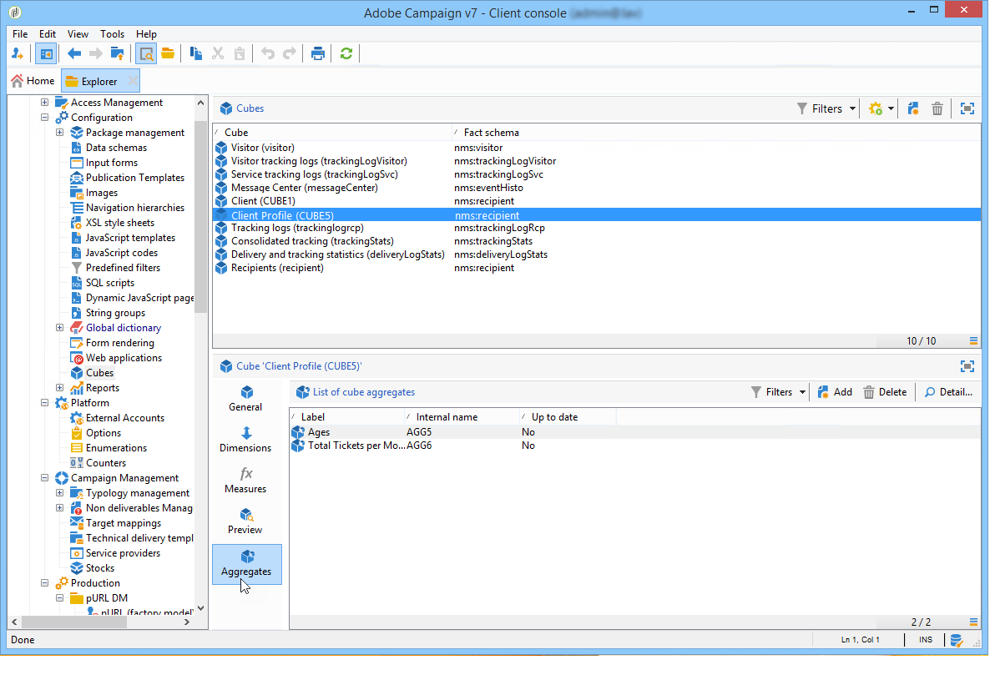

# Update aggregate{#update-aggregate}

Aggregates are defined at cube level for reporting purposes. A **[!UICONTROL Workflow]** tab is available when configuring an aggregate.
  
Aggregates are useful when manipulating large volumes of data. They are updated automatically based on settings defined in the dedicated workflow box, to integrate the data collect most recently into the indicators

Aggregates are defined in the relevant tab of each cube.

The **[!UICONTROL Update aggregate]** activity lets you select the update mode to apply: full or partial.

By default, a full update is carried out during each calculation. To enable a partial update, select the relevant option and define the update conditions.

**Good practice**: a **[!UICONTROL Scheduler]** activity can be used to specify the frequency of calculation updates.

