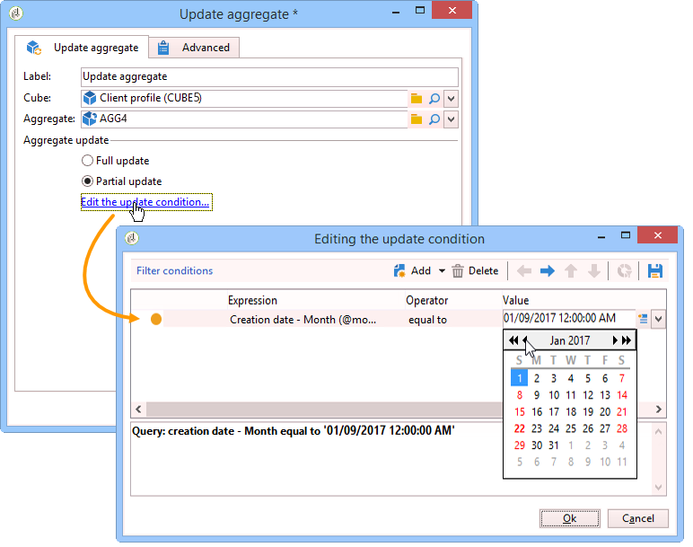
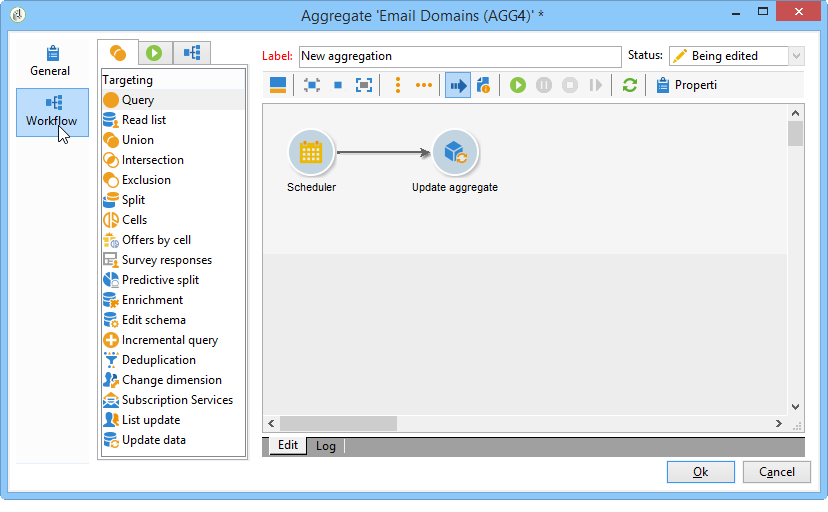

# Update aggregate{#update-aggregate}

Aggregates are defined at cube level for reporting purposes. A **[!UICONTROL Workflow]** tab is available when configuring an aggregate.

For more information on cubes and using aggregates in Adobe Campaign, refer to the dedicated [section](../../reporting/using/concepts-and-methodology.md#calculating-and-using-aggregates).

The **[!UICONTROL Update aggregate]** activity lets you select the update mode to apply: full or partial.

By default, a full update is carried out during each calculation. To enable a partial update, select the relevant option and define the update conditions.

**Good practice**: a **[!UICONTROL Scheduler]** activity can be used to specify the frequency of calculation updates.

