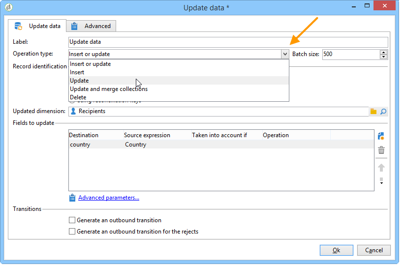
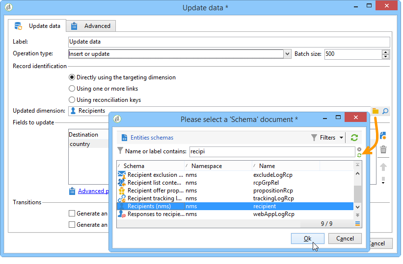
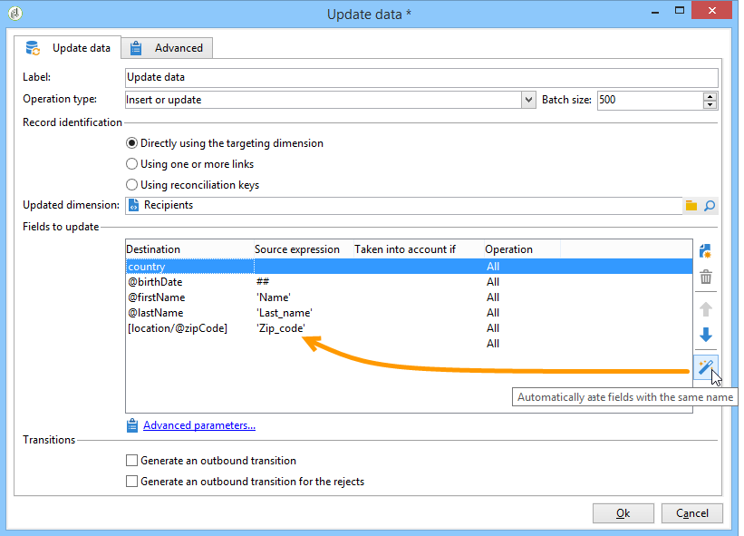
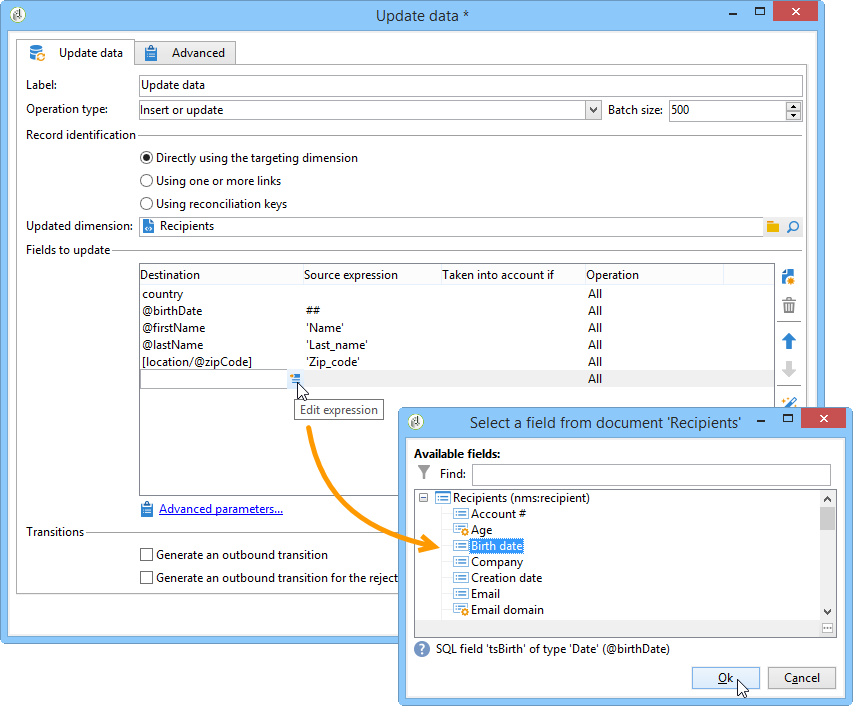
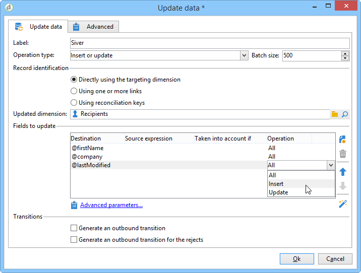
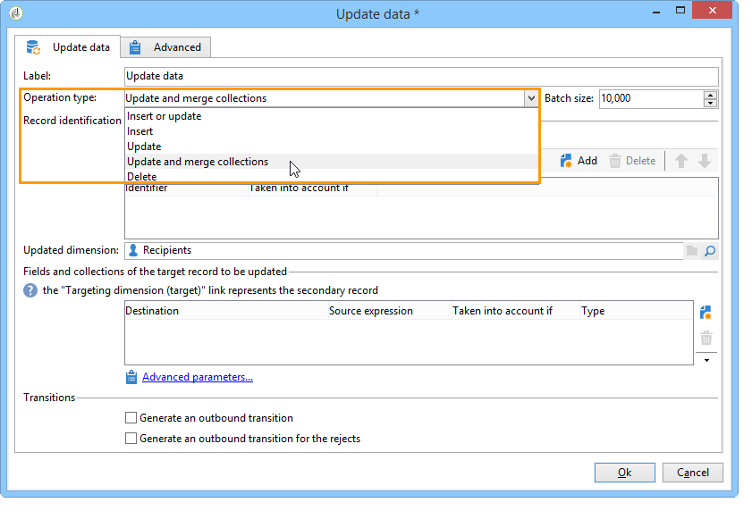
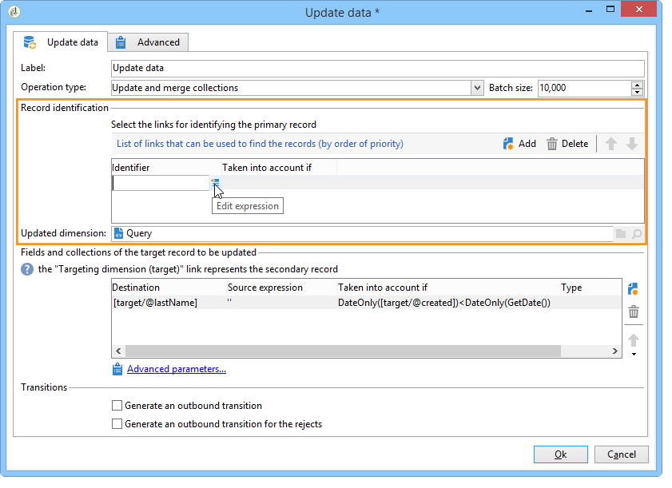
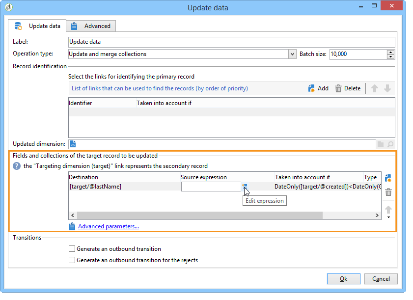

# Update data{#update-data}

An **Update data**-type activity performs a mass update of the fields in the database.

## Operation type {#operation-type}

The **[!UICONTROL Operation type]** field lets you choose the process to be carried out on the data in the database:

* **[!UICONTROL Insert or update]**: add data or update it if it has already been added.
* **[!UICONTROL Insert]**: only add data.
* **[!UICONTROL Update]**: only update data.
* **[!UICONTROL Update and merge collections]**: update data and choose a primary record, then link elements linked to the duplicates in this primary record. Duplicates can then be deleted without creating orphan attached elements.
* **[!UICONTROL Delete]**: delete data.

The **[!UICONTROL Batch size]** field lets you select the number of inbound transition elements to be updated. For example, if you state 500, the first 500 records dealt with will be updated.

## Record identification {#record-identification}

Specify how to identify the records in the database:

* If data entries relate to an existing targeting dimension, select the **[!UICONTROL By directly using the targeting dimension]** option and select it in the **[!UICONTROL Updated dimension]** field.

  You can display the fields for the selected dimension using the **[!UICONTROL Edit this link]** magnifying glass button.

* Otherwise, specify one or more links which will enable identification of the data in the database or direct use of reconciliation keys.

## Selecting the fields to be updated {#selecting-the-fields-to-be-updated}

Use the **[!UICONTROL Automatically associate fields with the same name]** option in order for Adobe Campaign to automatically identify the fields to be updated.

You can also use the **[!UICONTROL Insert]** icon to manually select the database fields to be updated.

Select all the fields to be updated and, if necessary, add conditions depending on which the update is to be carried out. To do this, use the **[!UICONTROL Taken into account if]** column. Conditions are applied one after the other and in keeping with the order in the list. Use the arrows on the right to change the order of updates.

You can use the same destination field several times.

Within an **[!UICONTROL Insert or update]** operation, you can select the campaign to be applied, either individually or for each field. To do this, select the desired value in the **[!UICONTROL Operation]** column.

The **[!UICONTROL modifiedDate]**, **[!UICONTROL modifiedBy]**, **[!UICONTROL createdDate]** and **[!UICONTROL createdBy]** fields are updated automatically during data updates, unless their management mode is configured specifically in the field update table.

Record updating is only performed for records containing at least one difference. If the values are the same, no update is performed.

The **[!UICONTROL Advanced parameters]** link lets you specify additional options to deal with updating data as well as managing duplicates. You may also:

* **[!UICONTROL Disable automatic key management]**.
* **[!UICONTROL Disable audit]**.
* **[!UICONTROL Empty the destination value if the source value is empty (NULL)]**. This option is automatically checked by default.
* **[!UICONTROL Update all columns with matching names]**.
* Specify conditions that consider source elements using an expression in the **[!UICONTROL Enabled if]** field.
* Specify conditions that consider duplicates using an expression. If you check the **[!UICONTROL Ignore records which concern the same target]** option, only the first in the list of expressions will be considered.

**[!UICONTROL Generate an outbound transition]**

Creates an outbound transition that will be activated at the end of execution. Updating usually signals the end of a targeting workflow, and the option is therefore not activated by default.

**[!UICONTROL Generate an outbound transition for the rejects]**

Creates an outbound transition containing records that have not been correctly processed after the update (for example if there is a duplicate). The update generally marks the end of a targeting workflow and therefore the option is not activated by default.

## Updating and merging collections {#updating-and-merging-collections}

Updating data and merging collections lets you update the data contained in a record by using data from one or multiple secondary records, with the aim of keeping just one if you wish. These updates are managed by a set of rules.

>[!NOTE]
>
>This option also lets you process references to secondary records from workflow work tables (targetWorkflow), deliveries (targetDelivery) and lists (targetList). If need be, these links appear in the list where you select fields and collections.

1. Select the **[!UICONTROL Update and merge collections]** operation.

   

1. Select the order of priority for the links. This allows you to identify the main record. The available links vary according to the inbound transition.

   

1. Select the collections to move to the primary record and the fields to update.

   Enter the rules that apply to these once one or multiple secondary records are identified. To do this, you can use the Expression builder. For more on this, refer to this [section](../../platform/using/defining-filter-conditions.md#building-expressions). For example, by specifying that it is the most recently updated value out of all the different records that must be kept.

   Then enter the conditions to take into account for the rule.

   Finally, specify the type of update to carry out. For example, you can choose to delete the secondary records after updating the data.

   You can, for example, configure the merging of collections containing heterogeneous data such as the list of subscriptions for a recipient. Using rules, you can also create new subscription histories from secondary record subscriptions, or even move the list of subscriptions from a secondary record to a primary record.

1. Specify the order in which you would like the secondary records to be processed, by selecting **[!UICONTROL Advanced parameters]** > **[!UICONTROL Duplicates]**.

   

Data for secondary records is associated with the main record if the defined rules are applicable. According to the type of update selected, the secondary records can be deleted.

## Example: Update data following an enrichment {#example--update-data-following-an-enrichment}

The [Step 2: Writing enriched data to the 'Purchases' table](creating-a-summary-list.md#step-2--writing-enriched-data-to-the--purchases--table) section of the use case that details creating a recap list offers an example of a data update after an enrichment activity.

## Input parameters {#input-parameters}

* tableName
* schema

Each inbound event must specify a target defined by these parameters.
