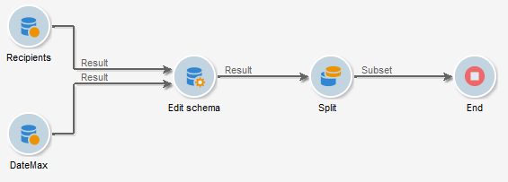
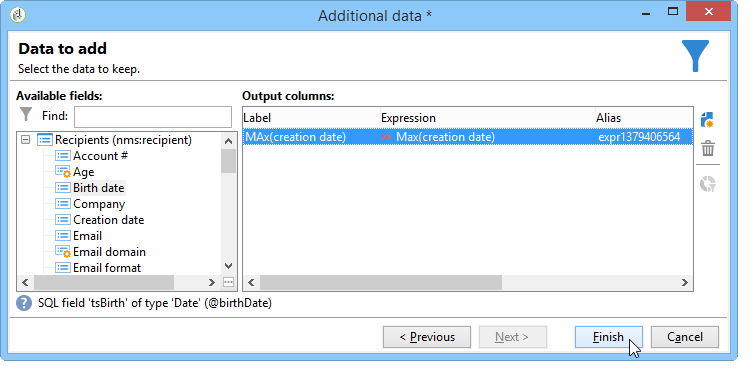
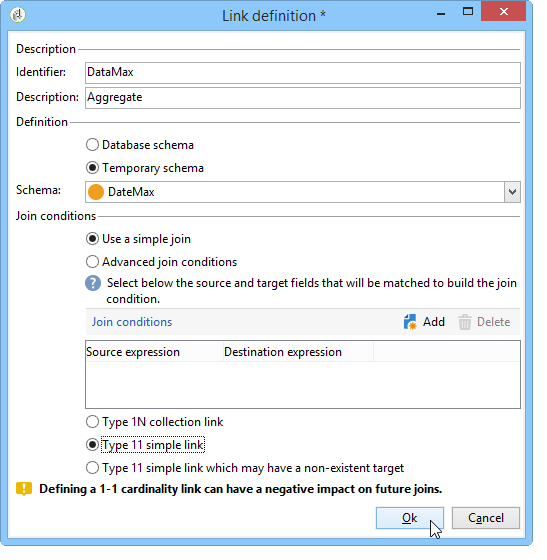
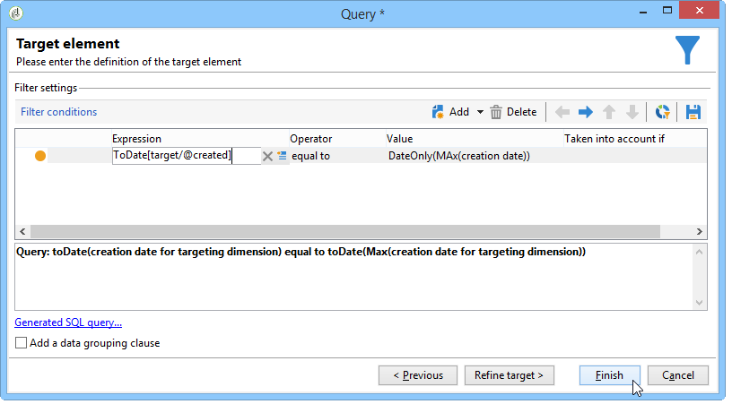

# Using aggregates{#using-aggregates}

This use case details how to automatically identify the last recipients added to the database.

Using the following process, the creation date of recipients in the database is compared to the last known date on which a recipient was created using an aggregate. All recipients created on the same day will also be selected.

To carry out a **Creation date = max (Creation date)** type filter on the recipients, you must run a workflow to follow these steps:

1. Retrieve database recipients using a basic query. For more on this step, refer to [Creating a query](../../workflow/using/query.md#creating-a-query).
1. Calculate the last known date a recipient was created using the result generated from the **max (Creation date)** aggregation function.
1. Link each recipient to the aggregation function result in the same schema.
1. Filter recipients using the aggregate via the edited schema.

## Step 1: Calculating the aggregate result {#step-1--calculating-the-aggregate-result}

1. Create a query. Here, the goal is to calculate the last known creation date out of all of the recipients in the database. The query therefore does not contain a filter.
1. Select **[!UICONTROL Add data]**.
1. In the windows that open, select **[!UICONTROL Data linked to the filtering dimension]** then **[!UICONTROL Filtering dimension data]**.
1. In the **[!UICONTROL Data to add]** window, add a column that calculates the maximum value for the **Creation date** field in the table of recipients. You can use the expression editor or enter **max(@created)** directly into a field in the **[!UICONTROL Expression]** column. Then click the **[!UICONTROL Finish]** button. 

   

1. Click **[!UICONTROL Edit additional data]** then **[!UICONTROL Advanced parameters...]**. Check the **[!UICONTROL Disable automatic adding of the primary keys of the targeting dimension]** option.

   This option ensures that all the recipients are not displayed as a result and that data added explicitly is not kept. In this case, it refers to the last date a recipient was created.

   Leave the **[!UICONTROL Remove duplicate rows (DISTINCT)]** option checked.

## Step 2: Linking the recipients and the aggregation function result {#step-2--linking-the-recipients-and-the-aggregation-function-result}

To link the query dealing with recipients to the query carrying out the aggregation function calculation, you must use a schema edit activity.

1. Define the query for recipients as a main set.
1. In the **[!UICONTROL Links]** tab, add a new link and enter the information in the window that opens as follows:

    * Select the temporary schema relating to the aggregate. The data for this schema will be added to the members of the main set.
    * Select **[!UICONTROL Use a simple join]** to link the aggregate result to every recipient of the main set.
    * Finally, specify that the link is a **[!UICONTROL Type 11 simple link]**.

   

The aggregation result is therefore linked to every recipient.

## Step 3: Filtering recipients using the aggregate. {#step-3--filtering-recipients-using-the-aggregate-}

Once the link has been established, the aggregate result and the recipients make up part of the same temporary schema. It is therefore possible to create a filter on the schema to compare the creation date of recipients and the last known creation date, represented by the aggregation function. This filter is carried out using a split activity.

1. In the **[!UICONTROL General]** tab, select **Recipients** as the targeting dimension and **Edit schema** as the filtering dimension (to filter on the inbound transition schema activity). 
1. In the **[!UICONTROL subsets]** tab, select **[!UICONTROL Add a filtering condition on the inbound population]** then click **[!UICONTROL Edit...]**.
1. Using the expression editor, add an equality criterion between the creation date of the recipients and the creation date calculated by the aggregate.

   The date type fields in the database are generally saved to the millisecond. You must therefore extend these for the entire day to avoid retrieving recipients created that same millisecond only.

   To do this, use the **ToDate** function, available in the expression editor, which converts dates and hours into simple dates.

   The expressions to use for the criteria are therefore:

    * **[!UICONTROL Expression]**: `toDate([target/@created])`.
    * **[!UICONTROL Value]**: `toDate([datemax/expr####])`, where expr#### relates to the aggregate specified in the aggregation function query.

   

The result of the split activity thus relates to the recipients created the same day as the last known creation date.

You can then add other activities such as a list update or a delivery to enrich your workflow.
