# Using the local approval activity{#using-the-local-approval-activity}

The **[!UICONTROL Local approval]** activity integrated into a targeting workflow lets you set up a recipient approval process before the delivery is sent.

>[!CAUTION]
>
>To use this function, you need to purchase the Distributed Marketing module, which is a Campaign option. Please check your license agreement.

To set up this use case, we created the following targeting workflow:

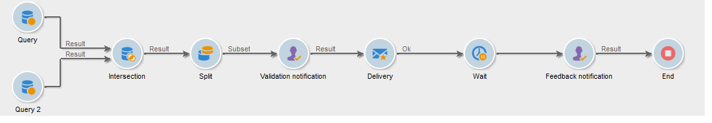

The main steps of the local approval process are:

1. The population resulting from targeting can be limited thanks to a **[!UICONTROL Split]** type activity using a data distribution model. 

   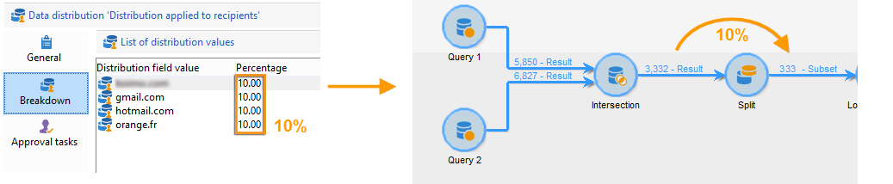

1. The **[!UICONTROL Local approval]** activity then takes over and sends a notification email to each local supervisor. The activity is pended until each local supervisor approves the recipients assigned to them.

   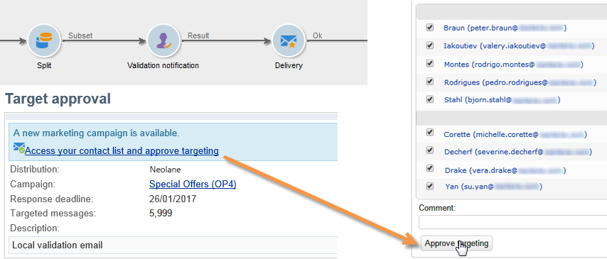

1. Once the approval deadline is reached, the workflow starts again. In this example, the **[!UICONTROL Delivery]** activity starts and the delivery is sent to the approved targets.

   >[!NOTE]
   >
   >Once the deadline is reached, recipients who haven't been approved are excluded from targeting.

   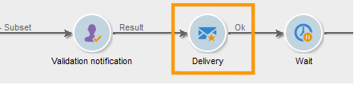

1. A few days later, the second **[!UICONTROL Local approval]** type activity sends a notification email to each local supervisor with a summary of the actions carried out by their contacts (clicks, opens, etc.). 

   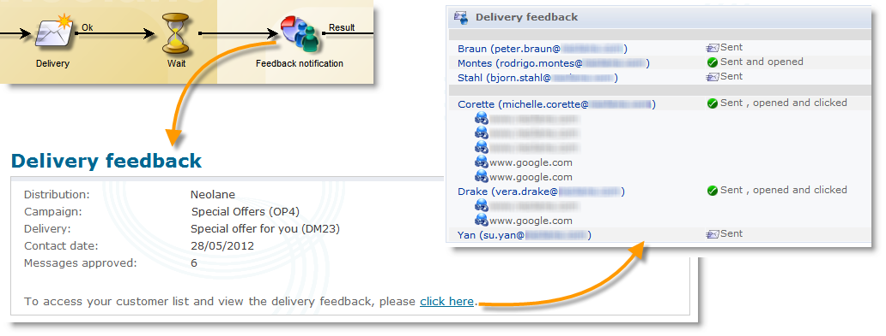

## Step 1: Creating the data distribution template {#step-1--creating-the-data-distribution-template-}

The data distribution template lets you limit the population resulting from targeting based on data grouping while enabling you to assign each value to a local supervisor. In this example, we have defined the **[!UICONTROL Email address domain]** field as a distribution field and assigned a domain to each local supervisor

For more on creating a data distribution template, refer to [Limiting the number of subset records per data distribution](split.md#limiting-the-number-of-subset-records-per-data-distribution).

1. To create the data distribution template, go to the **[!UICONTROL Resources > Campaign management > Data distribution]** node and click **[!UICONTROL New]**.

   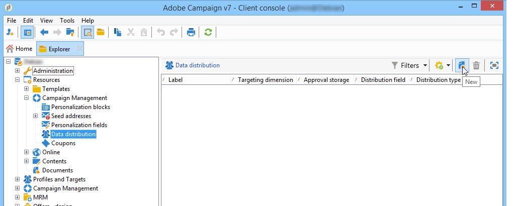

1. Select the **[!UICONTROL General]** tab.

   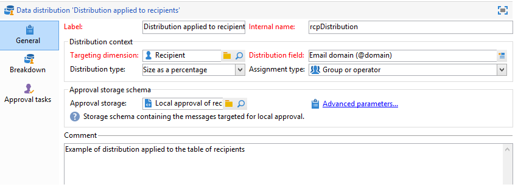

1. Enter the **[!UICONTROL Label]** and the **[!UICONTROL Distribution context]**. In this example, we have selected the **[!UICONTROL Recipient]** targeting schema and the **[!UICONTROL Email domain]** field as a distribution field. The list of recipients will be broken down by domain.
1. In the **[!UICONTROL Distribution type]** field, select how the target limitation value will be expressed in the **[!UICONTROL Distribution]** tab. Here, we have chosen **[!UICONTROL Percentage]**.
1. In the **[!UICONTROL Approval storage]** field, enter the storage schema of the approvals that match the targeting schema in use. Here we are going to use the default storage schema: **[!UICONTROL Local approval of recipients]**.
1. Then click the **[!UICONTROL Advanced parameters]** link.

   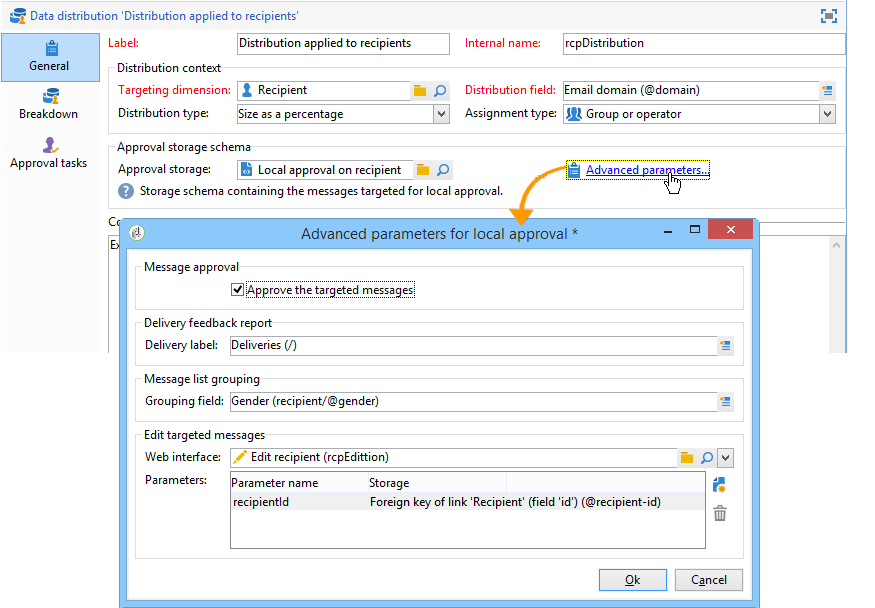

1. Keep the **[!UICONTROL Approve the targeted messages]** option checked so that all recipients are pre-selected from the list of recipients to approve.
1. In the **[!UICONTROL Delivery label]** field, we've left the default expression (compute string of the delivery). The standard label of the delivery will be used in the feedback notification.
1. In the **[!UICONTROL Grouping field]** section, we have selected the **[!UICONTROL Gender]** field as a grouping field for displaying recipients in the approval and feedback notifications.
1. In the **[!UICONTROL Edit targeted messages]** section, we've selected the **[!UICONTROL Edit recipients]** web application and the **[!UICONTROL recipientId]** parameter. In the approval and feedback notifications, recipients will be clickable and will point towards the URL of the web application. The additional URL parameter will be **[!UICONTROL recipientId]**.
1. Then click the **[!UICONTROL Distribution]** tab. For each domain, enter the following fields:

   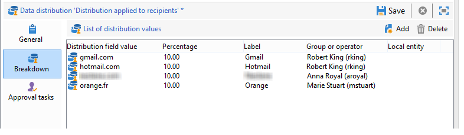

    * **[!UICONTROL Value]**: enter the value of the domain name. 
    * **[!UICONTROL Percentage / Fixed]**: for each domain, enter the max. number of recipients you want to send the delivery to. In this example, we want to limit the delivery to 10% per domain.
    * **[!UICONTROL Label]**: enter the label of the domain to be displayed in the approval and feedback notifications.
    * **[!UICONTROL Group or operator]**: select the operator or group of operators assigned to the domain.

      >[!CAUTION]
      >
      >Make sure the operators have been assigned the appropriate rights.

## Step 2: Creating the targeting workflow {#step-2--creating-the-targeting-workflow}

To set up this use case, we created the following targeting workflow:

The following activities were added:

* Two **[!UICONTROL Query]** activities,
* One **[!UICONTROL Intersection]** activity,
* One **[!UICONTROL Split]** activity,
* One **[!UICONTROL Local approval]** activity,
* One **[!UICONTROL Delivery]** activity,
* One **[!UICONTROL Wait]** activity,
* A second **[!UICONTROL Local approval]** activity,
* One **[!UICONTROL End]** activity.

### Queries, Intersection and Split {#queries--intersection-and-split}

Upstream targeting is made up of two queries, one intersection and one split. The population resulting from targeting can be limited using a **[!UICONTROL Split]** activity using a data distribution template.

For more on configuring a split activity, refer to [Split](split.md). The creation of a data distribution template is detailed in [Limiting the number of subset records per data distribution](split.md#limiting-the-number-of-subset-records-per-data-distribution).

If you do not want to limit the population from the query, you do not have to use the **[!UICONTROL Query]**, **[!UICONTROL Intersection]**, and **[!UICONTROL Split]** activities. In this case, complete the data distribution template in the first **[!UICONTROL Local approval]** activity.

1. In the **[!UICONTROL Record count limitation]** section, select the **[!UICONTROL Limit the selected records]** option and click the **[!UICONTROL Edit]** link.

   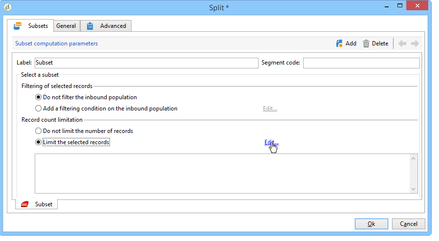

1. Select the **[!UICONTROL Keep only the first records after sorting]** option and click **[!UICONTROL Next]**.

   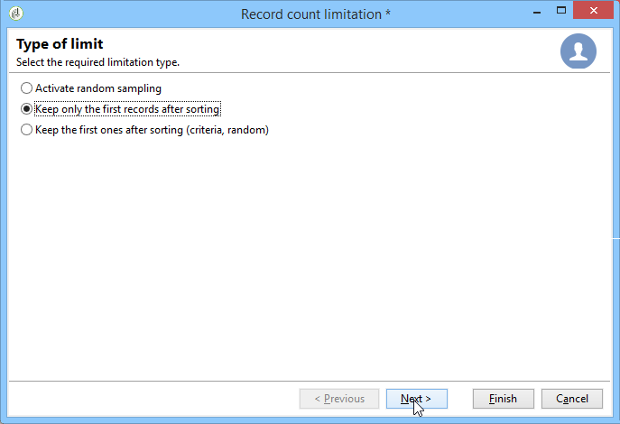

1. In the **[!UICONTROL Sort columns]** section, add the field which the sort is applied to. Here, we have chosen the **[!UICONTROL Email]** field. Click **[!UICONTROL Next]**.

   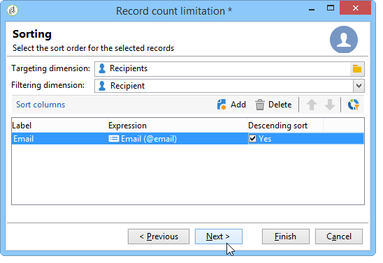

1. Select the **[!UICONTROL By data distribution]** option, select the distribution template created previously (refer to [Step 1: Creating the data distribution template](#step-1--creating-the-data-distribution-template-)) and click **[!UICONTROL Finish]**.

   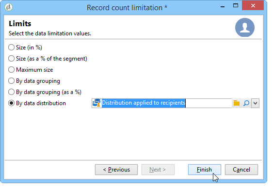

In the distribution template, we have chosen to limit the population to 10% per grouping value, which coincides with the values displayed in the workflow (340 as an input and 34 as an output).

### Approval notification {#approval-notification}

The **[!UICONTROL Local approval]** activity lets you send a notification to each local supervisor.

For more on configuring the **[!UICONTROL Local approval]** activity, refer to [Local approval](local-approval.md).

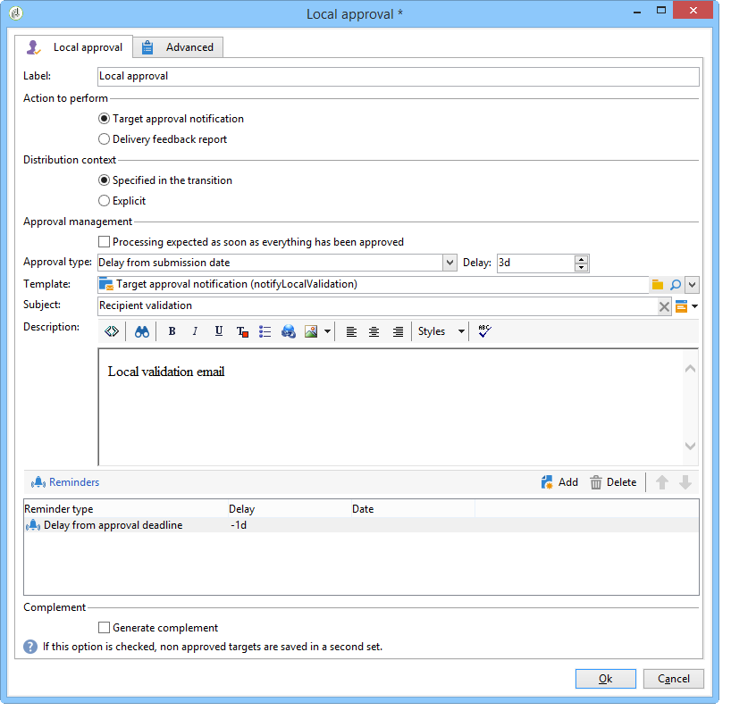

The following fields need to be entered:

1. In the **[!UICONTROL Action to execute]** section, select the **[!UICONTROL Target approval notification]** option.
1. In the **[!UICONTROL Distribution context]** section, select the **[!UICONTROL Specified in the transition]** option.

   If you don't want to limit the targeted population, select the **[!UICONTROL Explicit]** option here and enter the distribution template created previously in the **[!UICONTROL Data distribution]** field. 

1. In the **[!UICONTROL Notification]** section, select the delivery template and the subject to be used for the notification email. Here, we have chosen the default template: **[!UICONTROL Local approval notification]**.
1. In the **[!UICONTROL Approval schedule]** section, we've kept the default approval deadline (3 days) and added a reminder. The delivery will leave 3 days after the start of approval. Once the approval deadline has been reached, recipients who haven't been approved aren't taken into account by targeting.

The notification email sent by the **[!UICONTROL Local approval]** activity to local supervisors is as follows: 

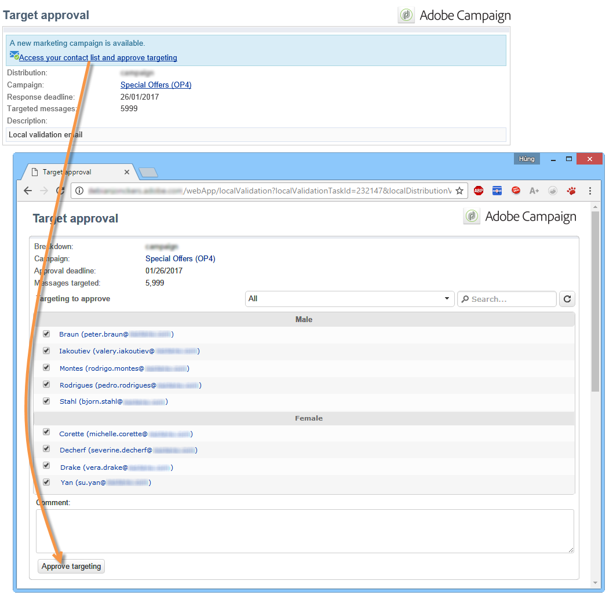

### Wait {#wait}

The wait activity lets you postpone the start of the second local approval activity that will send the delivery feedback notification. In the **[!UICONTROL Duration]** field, we have entered the **[!UICONTROL 5d]** value (5 days). The actions performed by recipients for 5 days following the sending of the delivery will be included in the feedback notification.

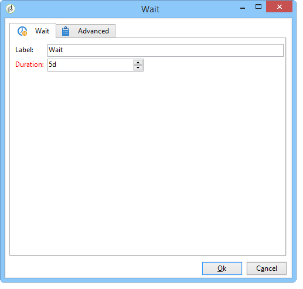

### Feedback notification {#feedback-notification}

The second **[!UICONTROL Local approval]** activity lets you send a delivery feedback notification to each local supervisor.

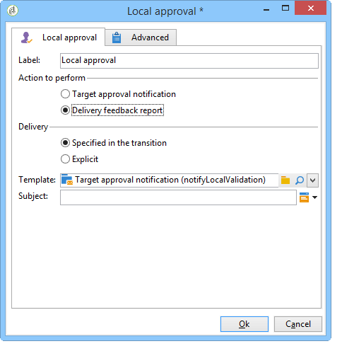

The following fields need to be entered.

1. In the **[!UICONTROL Action to execute]** section, choose **[!UICONTROL Delivery feedback report]**.
1. In the **[!UICONTROL Delivery]** section, choose **[!UICONTROL Specified in the transition]**. 
1. In the **[!UICONTROL Notification]** section, select the delivery template and the subject to be used for the notification email.

Once the deadline configured in the wait activity is reached, the second **[!UICONTROL Local approval]** type activity sends the following notification email to each local supervisor:

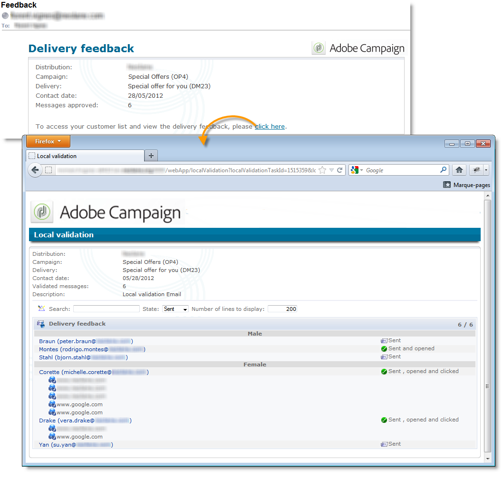

### Approval tracking by the administrator {#approval-tracking-by-the-administrator}

Each time the local approval activity starts, an approval task is created. The administrator can control each of these approval tasks.

Go to the targeting workflow of your campaign and click the **[!UICONTROL Local approval tasks]** tab.

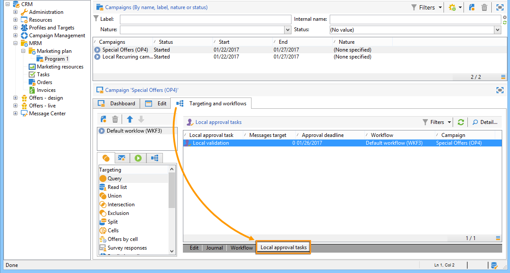

The list of local approval tasks can also be accessed via the **[!UICONTROL Approval tasks]** tab of the data distribution template.

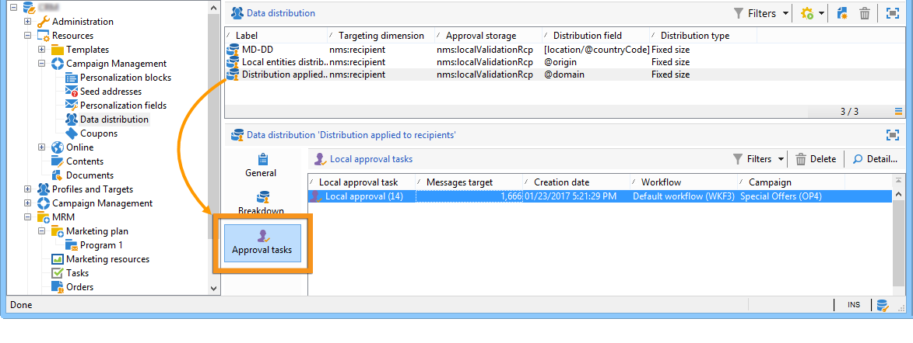

Select the task you want to monitor and click the **[!UICONTROL Detail]** button. The **[!UICONTROL General]** tab of the local approval task lets you view information on the task. If necessary, you can alter the approval and the reminder dates.

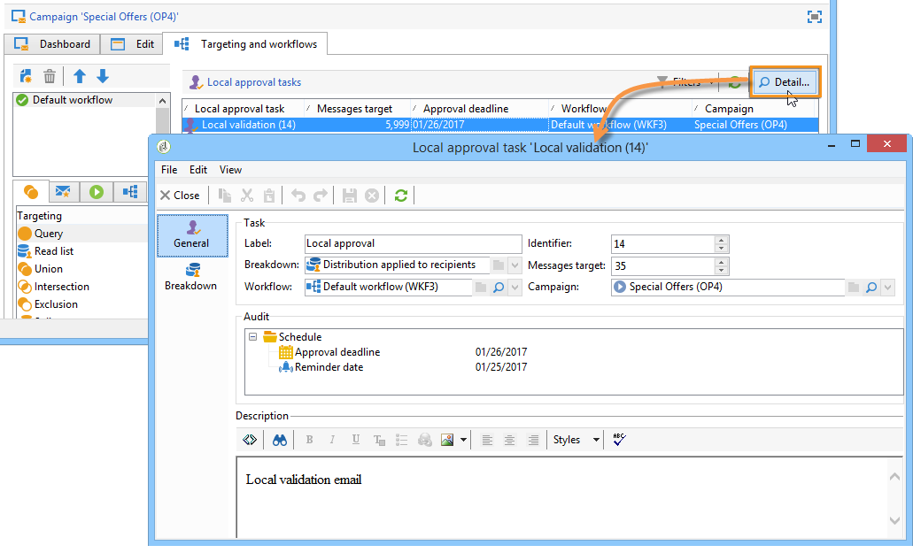

This tab shows the following information:

* the label of the task and its ID
* the distribution template used
* the number of targeted messages
* the linked workflow and campaign
* the task schedule

The **[!UICONTROL Distribution]** tab for the task lets you view the approval logs, their status, the number of messages targeted, the approval date, as well as the operator who approved the delivery.

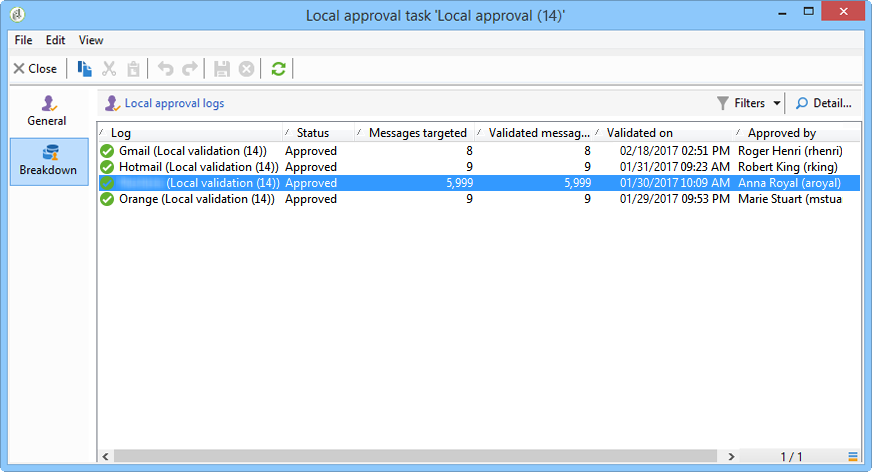

Select an approval log and click the **[!UICONTROL Detail]** button to display more information. The **[!UICONTROL General]** tab of the local approval log lets you view general log information. You can also change the approval status.

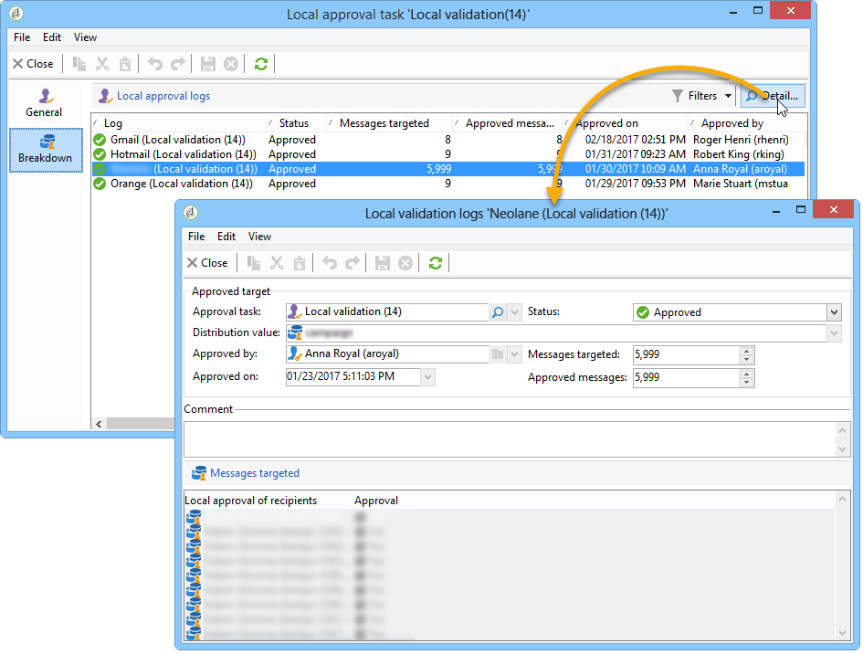

This tab shows the following information:

* the linked approval task
* the approval status (**[!UICONTROL Approved]** or **[!UICONTROL Pending]**)
* the distribution template used
* the local supervisor who approved and the approval date
* the number of messages targeted and approved

The **[!UICONTROL Targeted]** tab of the approval log displays the list of targeted recipients and their approval status. You can change this status if necessary. 

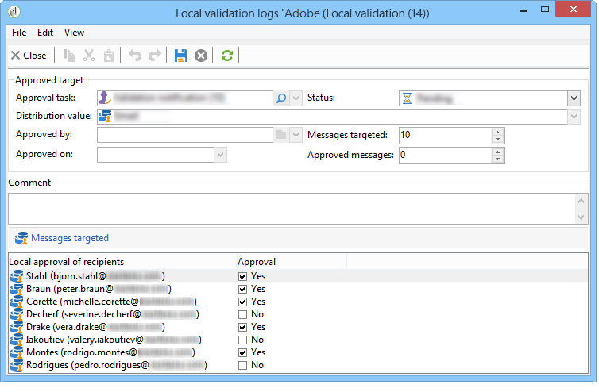
