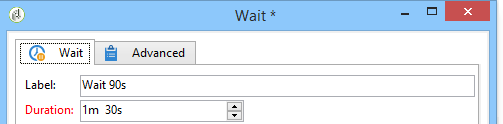

# Wait{#wait}

A **Wait** activity activates its transition after a time delay of anywhere between a few seconds and several months. A wait task does not block the execution of other tasks; the workflow can execute tasks in parallel while this task is pending.

You can enter the label and wait time using the editor, as in the example below:

In the **[!UICONTROL Duration]** field, the value can be expressed in the unit of your choice: (according to the operator's regional settings):

* If regional settings are not specified: **s** for seconds, **m** for minutes, **h** for hours, **d** for days, **y** for years. At the time of approval, the value is automatically converted to the most readable unit.

  The default unit is the day (**d**).

* Whereas if, for example, the regional settings are set to 'Français': **s** for seconds, **mn** for minutes, **h** for hours, **j** for days, **m** for months, **a** for years. At the time of approval, the value is automatically converted to the most readable unit, as in the example above **90s** was converted to **1mn 30s**.

  The default unit is the day (**d**).
