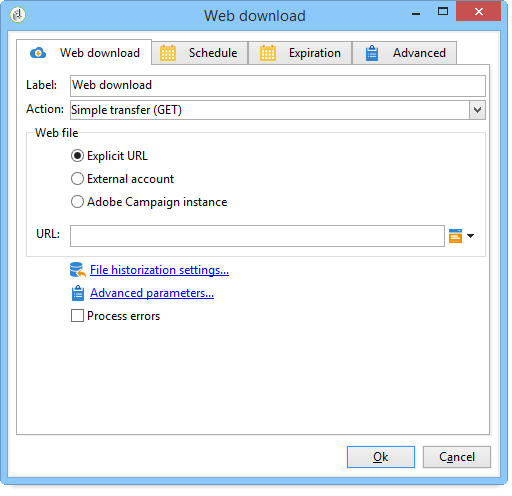
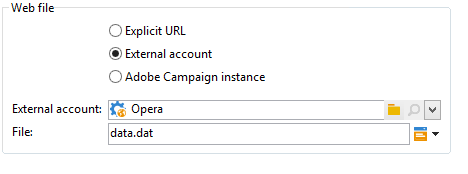
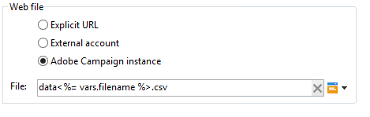
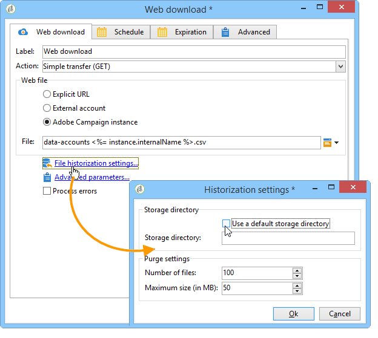

# Web download{#web-download}

The **Web download** activity launches the downloading of a file on an explicit URL, an external account, or an Adobe Campaign instance. The HTTP protocol is used. This can be a GET or POST download.

## Properties {#properties}

1. **Selecting the Web file**

   To specify the file to be downloaded, you can enter the file URL, use the external HTTP account where the file is stored or load the file via an Adobe Campaign instance. The available parameters are detailed below:

    * To directly enter the URL of the file to be downloaded, select the **[!UICONTROL Explicit URL]** option and specify the URL in the appropriate field. This URL can be constructed with variable data.
    
      

    * To use an **[!UICONTROL External account]**, select the account from the drop-down list, and specify the file to be downloaded.

      External accounts are configured from the **[!UICONTROL Administration > Platform > External accounts]** node of the Adobe Campaign tree. The account parameters can be edited via the **[!UICONTROL Edit link]** icon.
    
      

    * To download the file from the Adobe Campaign instance, select the **[!UICONTROL Adobe Campaign Instance]** option.
    
      

1. **File historization**

   The **[!UICONTROL File historization settings...]** link lets you specify the file storage directory and the purge frequency of this directory.

   

   The following options are available:

    * **[!UICONTROL Use a default storage directory]**: the file is always moved before being processed. If this option is checked, the file is moved into the default storage directory (the **vars** directory of the Adobe Campaign installation folder). To specify a storage directory, uncheck the box and enter its path in the **[!UICONTROL Storage directory]** field 
    * **[!UICONTROL Number of files]**: enter the maximum number of files to be kept in the storage directory.
    * **[!UICONTROL Maximum size (in Mb)]**: enter the maximum capacity of the storage directory (in megabytes).

   Each file is kept for 24 hours before being subjected to the defined purging rules. The purge takes place just before the start of the activity and therefore does not take into account the workflow file in progress.

   Files are deleted as a function of their age (oldest to newest). The oldest files are purged until both purge rules are verified. Therefore, if a 100-file limit is defined, this means that the storage directory will always contain the 100 newest files before the start of the workflow, as well as those being processed in the workflow that is in progress.

   If you no longer want to set a limit for the **[!UICONTROL Number of files]** and **[!UICONTROL Maximum size (in Mb)]** options, enter 0 as a value.

1. **Advanced parameters**

   The **[!UICONTROL Advanced parameters...]** link lets you specify the additional options shown below:

   

   The **[!UICONTROL Process errors]** option is detailed in [Processing errors](../../workflow/using/monitoring-workflow-execution.md#processing-errors).

## Output parameters {#output-parameters}

* filename: Complete name of the downloaded file.
