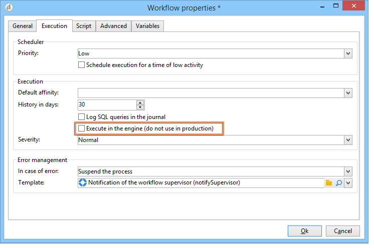
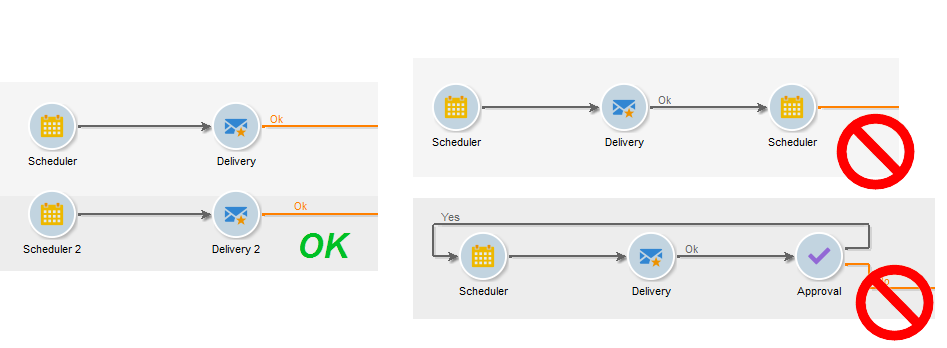
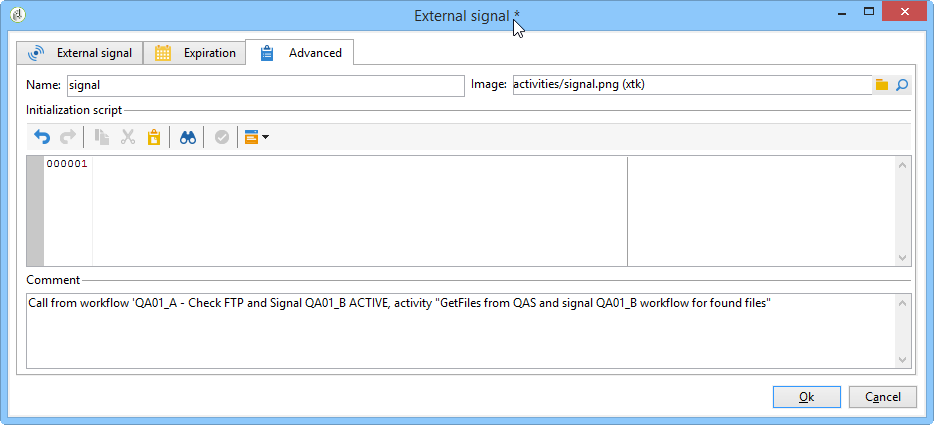

# Workflow best practices{#workflow-best-practices}

## Execution and performance {#execution-and-performance}

Below are listed general guidelines about optimizing Campaign performance, including best practices to apply to your workflows. 

Troubleshooting guidelines related to workflows execution are also available in [Campaign Classic v7 Production Guide](../../production/using/workflow-execution.md).

### Logs {#logs}

The JavaScript method **[!UICONTROL logInfo()]** is a great solution for debugging a workflow. It is useful but it must be used carefully, especially for activities that are frequently run: it can overload the logs and significantly increase the size of the log table. But you might also need more than **[!UICONTROL logInfo()]**.

Two additional solutions are available to help:

* **Keep the result of interim populations between two executions**

  This option keeps temporary tables between two executions of a workflow. It is available in the workflow properties' **[!UICONTROL General]** tab, and can be used for development and test purpose to monitor data and check results. You can use this option in development environments, but never use it on production environments. Keeping temporary tables could result in the size of the database increasing significantly and eventually the size limit being reached. Moreover, it will slow down the backup.

  Only the working tables of the last execution of the workflow are kept. Working tables from previous executions are purged by the **[!UICONTROL cleanup]** workflow, which runs on a daily basis.

  >[!CAUTION]
  >
  >This option must never be checked in a production workflow. This option is used to analyze the results and is designed only for testing purposes and hence must be used only on development or staging environments.

* **Log SQL queries in the journal**

  Available in the **[!UICONTROL Execution]** tab of workflow properties, this option will log all SQL queries generated by the tool from the different activities. It is a good way to see what is actually executed by the platform. However, this option should only be used temporarily during development and not activated on production.

Purge the logs when they are not needed anymore. Workflow history is not purged automatically: all messages are kept by default. History can be purged via the **[!UICONTROL File > Actions]** menu or by clicking the Actions button located in the toolbar above the list. Select Purge history.
To learn how to purge your logs, refer to this [documentation](starting-a-workflow.md).

### Workflow planning {#workflow-planning}

* Try to maintain a stable level of activity along the day and avoid peaks to prevent the instance from overload. To do so, distribute workflow starting times evenly throughout the day.
* Schedule data load overnight to reduce resource contention.
* Long workflows can potentially have an impact on the server and database resources. Split the longest workflows to reduce processing time.
* To reduce overall run times, replace time-consuming activities with simplified and faster activities.
* Avoid running more than 20 workflows simultaneously. When too many workflows are executed at the same time, the system can run out of resources and become unstable. For more information on why your workflow may not be starting, refer to this [article](https://helpx.adobe.com/ie/campaign/kb/workflows-not-starting-in-a-campaign-technical-workflows.html).

### Workflow execution {#workflow-execution}

It is a best practice not to schedule a workflow to run more than every 15 minutes because it may impede overall system performance and create blocks in the database.

Avoid leaving your workflows in a paused state. If you create a temporary workflow, make sure it will be able to finish correctly and not stay in a **[!UICONTROL paused]** state. If it is paused, it would imply that you need to keep the temporary tables and thus increase the size of the database. Assign Workflow Supervisors under Workflow Properties to send an alert when a workflow fails or is paused by the system.

To avoid having workflows in a paused state:

* Check your workflows on a regular basis to ensure there are no unexpected errors.
* Keep your workflows as simple as possible, for example by splitting large workflows in several different workflows. You can use **[!UICONTROL External signal]** activities trigger their execution based on other workflows' execution.
* Avoid having disabled activities with flows in your workflows leaving threads open and leading to many temporary tables that can consume a lot of space. Do not keep activities in **[!UICONTROL Do not enable]** or **[!UICONTROL Enable but do not execute]** states in your workflows.

Also, stop unused workflows. Workflows that keep running maintain connections to the database.

Only use unconditional stop in the rarest cases. Do not use this action on a regular basis. Not performing a clean closure on connections generated by workflows to the database impacts performance.

### Execute in the engine option {#execute-in-the-engine-option}

In the **[!UICONTROL Workflow properties]** window, never check the **[!UICONTROL Execute in the engine]** option. When this option is enabled, the workflow takes priority and all other workflows are stopped by the workflow engine until this one is finished.

## Workflow properties {#workflow-properties}

### Workflow folders {#workflow-folders}

Adobe recommends you to create your workflows in a dedicated folder.

If the workflow affects the whole platform (cleansing processes for example), you can consider adding a sub-folder in the built-in **[!UICONTROL Technical Workflows]** folder.

### Workflow naming {#workflow-naming}

Because it makes them easier to find and troubleshoot if they are not performing in the expected ways, Adobe recommends to give your workflows proper names and labels: fill in the workflow's description field to summarize the process to be performed so that the operator can easily understand it.

If the workflow is part of a process involving multiple workflows, you can be explicit when entering a label; using numbers is a great way to order the workflows (by Label).

For example:

* 001 - Import - Import recipients
* 002 - Import - Import sales
* 003 - Import - Import sales details
* 010 - Export - Export delivery logs
* 011 - Export - Export tracking logs

### Workflow severity {#workflow-severity}

You can configure the severity of a workflow in the workflow properties, in the **[!UICONTROL Execution]** tab:

* Normal
* Production
* Critical

Providing this information when creating a workflow will help you understand the severity of the process configured.

This option has no functional impact on workflows other than campaign workflows.

Campaign workflows (workflows created as part of a campaign/operation) with a higher severity are executed in priority in case the campaign has many processes supposed to run simultaneously. By default, only 10 processes can run simultaneously in a campaign, according to the option NmsOperation_LimitConcurrency. For example, if a campaign contains 25 workflows, workflows with a higher severity will then be executed in the first pool of 10 processes.

### Workflow monitoring {#workflow-monitoring}

All your scheduled workflows running on production environments should be monitored in order to be alerted if there is an error.

In the workflow properties, select a Supervisor group, either the default **[!UICONTROL Workflow supervisors]** or a custom group. Make sure that at least one operator belongs to this group, with an email set up.

Before you start building a workflow, remember to define workflow supervisors. They will be notified by email in case of errors. For more on this, refer to [Managing errors](monitoring-workflow-execution.md#managing-errors).

Regularly check the **[!UICONTROL Monitoring]** tab to view the overall status of the active workflows. For more on this, refer to [Instance supervision](monitoring-workflow-execution.md#instance-supervision).

The Workflow HeatMap enables the Adobe Campaign platform administrators to monitor the load on the instance and plan workflows accordingly. For more on this, refer to [Workflow monitoring](heatmap.md).

## Using activities {#using-activities}

>[!CAUTION]
>
>You can copy and paste activities within a same workflow. However, we do not recommend to copy paste activities across different workflows. Some settings attached to activities like Deliveries and Scheduler could lead to conflicts and errors while executing the destination workflow. Instead, we recommended you to  **Duplicate** workflows. For more information, see [Duplicating workflows](building-a-workflow.md#duplicating-workflows).

### Name of the activity {#name-of-the-activity}

While developing your workflow, all activities will have a name, as will all Adobe Campaign objects. While the name is generated by the tool, we recommend you rename it with an explicit name when configuring it. The risk with doing it later is that it may interrupt the workflow with activities using the name of another previous activity. So it would be a difficult job to update the names afterward.

The activity name can be found in the **[!UICONTROL Advanced]** tab. Don’t leave them named **[!UICONTROL query]**, **[!UICONTROL query1]**, **[!UICONTROL query11]**, but give them explicit names such as **[!UICONTROL querySubscribedRecipients]**. This name will show up in the journal, and if applicable in the SQL logs, and this will help to debug the workflow when configuring it.

### First and last activities {#first-and-last-activities}

* Always start your workflow with a **[!UICONTROL Start]** activity or a **[!UICONTROL Scheduler]** activity. When relevant, you can also use an **[!UICONTROL External signal]** activity.
* When building your workflow, only use one **[!UICONTROL Scheduler]** activity per branch. If the same branch of a workflow has several schedulers (linked to each other), the number of tasks to be executed will be multiplied exponentially, which would considerably overload the database. This rule also applies to all activities with a **[!UICONTROL Scheduling & History]** tab. Learn more on [Scheduling](scheduler.md).

  

* Use **[!UICONTROL End]** activities for every workflow. This lets Adobe Campaign free up temporary space used for calculations within workflows. For more on this, refer to: [Start and end](start-and-end.md).

### Javascript within an activity {#javascript-within-an-activity}

You may want to add JavaScript when initializing a workflow activity. This can be done in an activity's **[!UICONTROL Advanced]** tab of the activity.

To make spotting the workflow easier, we recommend using double dashes at the start and end of the activity label as follows: -- My label --.

### Signal {#signal}

Most of the time, you will not know where the signal is called from. In order to avoid this problem, use the **[!UICONTROL Comment]** field within the **[!UICONTROL Advanced]** tab of the signal activity to document the expected origin of a signal for this activity.

## Workflow update {#workflow-update}

A production workflow should not be updated directly. Unless the process consists of creating a campaign with template workflows, processes should first be tested on a development environment. After this validation, the workflow can be deployed and started on production.

Perform all testing in development or staging environments, not in production environments. Performance cannot be ensured in such a case.

Archived workflows may be kept on development or test platforms, in an Archived folder, but production environment should stay as clean as possible. Old workflows should be removed from production environment if they are inactive.
