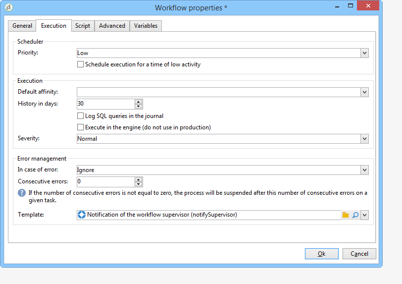
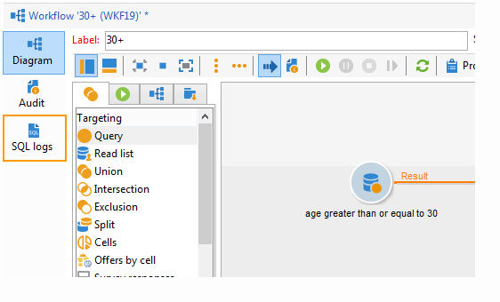
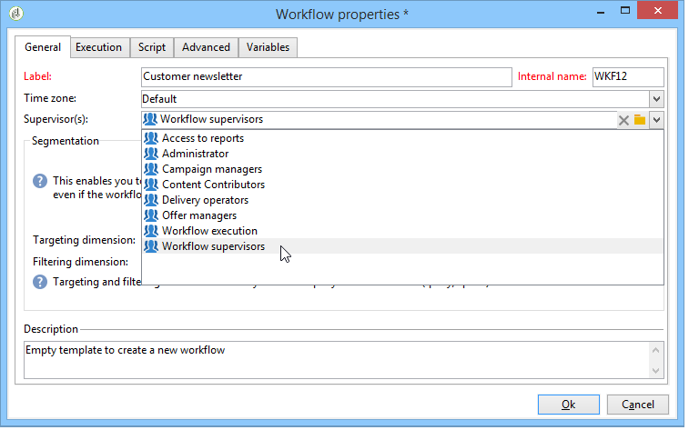

# Workflow properties{#workflow-properties}

## Execution tab {#execution-tab}

The **[!UICONTROL Execution]** tab of the **[!UICONTROL Properties]** window in a workflow is broken down into 3 sections:

### Scheduler {#scheduler}

This section is only displayed in campaign workflows.

* **[!UICONTROL Priority]**

  The workflow engine processes the workflows to be executed based on the priority criterion defined in this field. For instance, all workflows with an **[!UICONTROL Average]** priority will be executed before those with a **[!UICONTROL Low]** priority.

* **[!UICONTROL Schedule execution for a time of low activity]**

  This option postpones workflow start to a less busy period. Some workflows can be costly in terms of resources for the database engine. We recommend scheduling execution for a time of low activity (at night for instance). Low activity periods are defined in the **[!UICONTROL Processes on campaigns]** technical workflow.

### Execution {#execution}

* **[!UICONTROL Default affinity]**

  If your installation includes several workflow servers, use this field to choose the machine which the workflow will be executed on. If the value defined in this field doesn't exist on any server, the workflow will remain pending.

  Refer to this [Campaign Classic v7 installation guide](../../installation/using/configuring-campaign-server.md#high-availability-workflows-and-affinities).

* **[!UICONTROL History in days]**

  The work tables of the database keep a history of executions (tasks, events, log). Here you can define the number of days to be archived for this workflow: the cleanup process will delete the oldest archives once a day. If the value in this field is zero, the archive will never be deleted.

* **[!UICONTROL Log SQL queries in the journal]**

  This functionality is reserved for advanced users. It concerns workflows that contain targeting activities (query, union, intersection, etc.). When this option is checked, the SQL queries sent to the database during workflow execution are displayed in Adobe Campaign: this means you can analyze them to optimize queries or diagnose issues.

  Queries are displayed in an **[!UICONTROL SQL logs]** tab which is added to the workflow (except campaign workflows) and to the **[!UICONTROL Properties]** activity when the option is enabled. The **[!UICONTROL Audit]** tab also includes SQL queries. 

  

* **[!UICONTROL Execute in the engine]**

  This option may only be used for de-bugging and never in production. When it is enabled, the workflow takes priority and all other workflows are stopped until this one is finished.

### Error management {#error-management}

* **[!UICONTROL Troubleshooting]**

  This field lets you define the actions to be taken if a workflow task has errors. There are two possible options:

    * **[!UICONTROL Stop the process]**: the workflow is automatically paused. the workflow status changes to **[!UICONTROL Failed]**. Once the issue is solved, restart the workflow using the **[!UICONTROL Start]** or **[!UICONTROL Restart]** buttons.
    * **[!UICONTROL Ignore]**: the status of the task that triggered the error changes to **[!UICONTROL Failed]**, but the workflow keeps the **[!UICONTROL Started]** status. This configuration is relevant for recurring tasks: if the branch includes a scheduler, it will start normally next time the workflow is executed.

* **[!UICONTROL Consecutive errors]**

  This field becomes available when the **[!UICONTROL Ignore]** value is selected in the **[!UICONTROL In case of errors]** field. You can specify the number of errors that can be ignored before the process is stopped. Once this number is reached, the workflow status changes to **[!UICONTROL Failed]**. If the value of this field is 0, the workflow will never be stopped regardless of the number of errors.

* **[!UICONTROL Template]**

  This field lets you select the notification template to be sent to the workflow supervisors when its status changes to **[!UICONTROL Failed]**.

  The concerned operators will be notified by email, if there is an email address in their profile. To define workflow supervisors, go to the **[!UICONTROL Supervisor(s)]** field of the properties (**[!UICONTROL General]** tab).

  

  The **[!UICONTROL Notification to a workflow supervisor]** default template includes a link for accessing the Adobe Campaign console via the Web so that the recipient can work on the issue once they are logged on.

  To create a personalized template, go to **[!UICONTROL Administration>Campaign management>Technical deliveries and templates]**.
